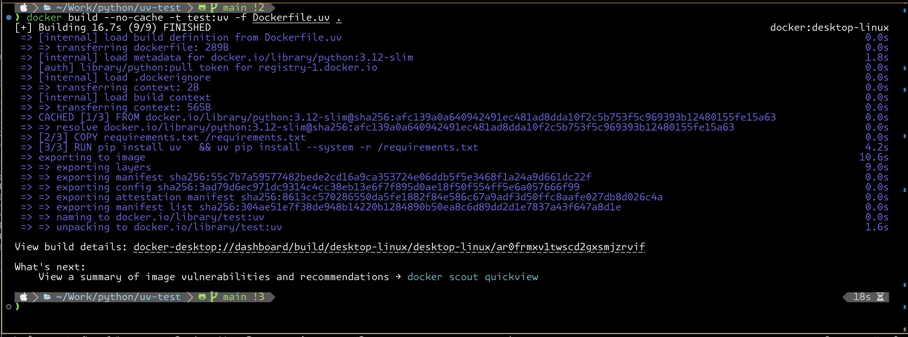

# Compare Docker Image Build: PIP vs UV

## Docker image build

### PIP

```python
FROM python:3.12-slim

LABEL maintainer="Supphachoke Suntiwichaya <mrchoke@gmail.com>"

COPY requirements.txt /requirements.txt
RUN pip install -r /requirements.txt

CMD ["pip", "freeze"]
```

```
docker build --no-cache -t test:pip -f Dockerfile.pip
```


### UV

```python
FROM python:3.12-slim

LABEL maintainer="Supphachoke Suntiwichaya <mrchoke@gmail.com>"

ENV VIRTUAL_ENV /usr/local

COPY requirements.txt /requirements.txt
RUN pip install uv \
  && uv pip install -r /requirements.txt

CMD ["uv", "pip", "freeze"]
```

```
docker build --no-cache -t test:uv -f Dockerfile.uv
```



## Result

### Time

| Type | Build | Overall |
| ---- | ----- | ------- |
| pip  | 35.6s | 36s     |
| uv   | 25.7s | 26s     |

### Size

| Type | Size  |
| ---- | ----- |
| pip  | 802MB |
| uv   | 648MB |


