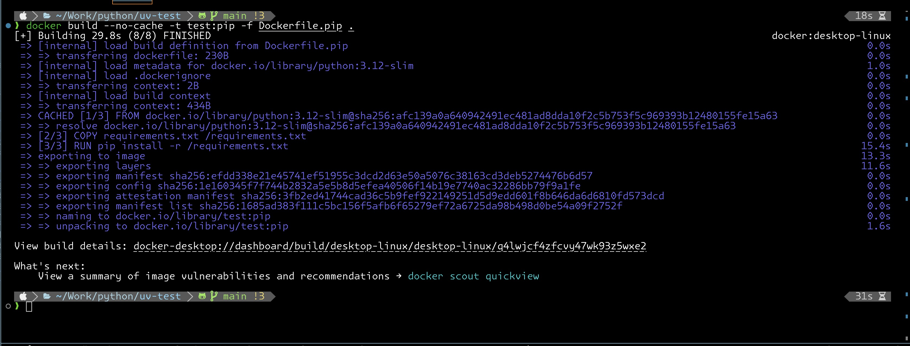

# Compare Docker Image Build: PIP vs UV

## Docker image build

### PIP

```dockerfile
FROM python:3.12-slim

LABEL maintainer="Supphachoke Suntiwichaya <mrchoke@gmail.com>"

COPY requirements.txt /requirements.txt
RUN pip install -r /requirements.txt

CMD ["pip", "freeze"]
```

```bash
docker build --no-cache -t test:pip -f Dockerfile.pip .
```



### UV

```dockerfile
FROM ghcr.io/astral-sh/uv:latest as uv
FROM python:3.12-slim

COPY --from=uv /uv /bin/uv
LABEL maintainer="Supphachoke Suntiwichaya <mrchoke@gmail.com>"

COPY requirements.txt /requirements.txt
RUN uv pip install --system -r /requirements.txt

CMD ["uv", "pip", "list", "--format" ,"freeze"]
```

```bash
docker build --no-cache -t test:uv -f Dockerfile.uv .
```


## Result

### Time

| Type | Build | Stage3/3 |
| ---- | ----- | -------- |
| pip  | 31s   | 15.4s    |
| uv   | 18s   | 4.2s     |

### Size

| Type | Size  |
| ---- | ----- |
| pip  | 813MB |
| uv   | 655MB |


